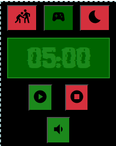

# Проект Pomodoro Tracker
## Используемые технологии: 
* React JS
* Redux
  
## Идея проекта
* Создавал простенький проект для личных нужд и тренировки навыка создания приложения. Хотел его сделать полноценным Desktop приложением подключив Electron, но завбросил данный проект из за плохой структуры кода. Планировал изучить архитектуру фронтенд приложений и переделать проект. Но с какого то времени я отвлекся на разработку игр в Unity для сдачи дипломной работы.
* В будущем хочу переделать и доделать данный проект с хорошей чистой архитектурой, без использования Redux.

## Изображение приложения


## Запуск приложения
```
cd react-pomidoro
npm i
npm start
```